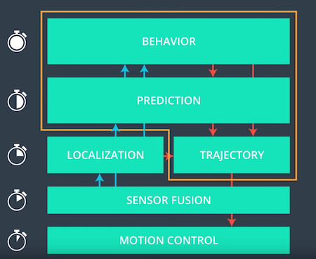

Overview
========

The goal of the project is to safely navigate the ego car on the highway
in the simulator. The highway has three lanes and other traffic is
driving at a max speed of 50 PMH. The 50 MPH is the speed limit. The
path planner receives the sensor fusion data from the simulator. The
sensor fusion data contain location and speed information from
surrounding traffic. Map data is available in the form of waypoints. The
car needs to ensure to keep on the road and for most of the time within
a lane (only for lane change the car should be outside of a lane). The
car needs to drive safely and should not crash into other cars. It is
not sufficient to stay only on the initial lane – the car should perform
lane changes to drive as fast as possible but needs to respect the speed
limit. Also, the car should not experience total acceleration over 10
m/s\^2 and jerk that is greater than 10 m/s\^3

## Path Planner
### The Map
The path planner is implemented in main.cpp. It first is initialized with the map data in form of way points. The way points are rather coarse and not precise enough for navigation on the map, therefore a high-resolution map (1m resolution) is generated using spline interpolation.

### Sensor Data Loop
Every 20ms the simulator sends sensor fusion data to path planner. The path planner processes this data using the following pipeline to create updated path information for the vehicle motion controller of the simulated car.

### Localization
The localization determines the position of the car in Frenet coordinates. 

### Prediction
Prediction creates trajectories for the cars nearby the ego car to create an understanding about their current position and behavior in the future. This information is used within the behavior planner to make decision regarding speed and lane of the ego car in the future. Prediction is implemented in the file prediction.cpp

### Behavior Planning
The behavior planning is based on a finite state machine approach to model different state the ego car can take. Depending on each state and the predictions about the other cars, behavior (state) changes will be determined.

The following drawing shows the state diagram which is implemented. The state machine is using the implementation provided by Michael Egli https://github.com/eglimi/cppfsm

The "Lane Keep" state is straight forward. It simply accelerates to a little below the speed limit. In case of a slower car in front of the ego car it decelerates and sets a trigger to prepare a lane change

Within the "PrepLangeChange" state the behavior planner analysis the predictions about the other cars to initiate a potential lane change. It evaluates all potential lane change options and associates a cost to each of these option. With the cost function lanes with no or faster cars in front a cheaper than lanes with slower cars in front or lane changes which will result in a crash. To identify potential crashes the predicted trajectories for other cars ond the ego car are used in conjunction with the separation of axis theorem.

The two lane change states are executing the lane changes. 

### Trajectory Generation
For lane changes the required trajectories are calculated using the jerk minimizing trajectory approach demonstrated within the lectures.
Due to communication latency between the simulator and path planner, a portion of the previous path (~0.5 sec) is kept as a buffer and the new path is appended after that to keep smooth continuous transitions. Non lane changing trajectories which require acceleration or deceleration calculated in frenet coordinates (s,d) which makes changing acceleration easier.

Reflection
==========

The implementation of the path planner work pretty well. It does not consider certain scenarios:
- Misbehavior of other cars
- Re-assessing of the situation during a lane change (lane change can't be aborted)
- Optimizing speed: currently the ego car can't go slower fall behind and than find a space for a lane change
- Reducing speed in curves and going closer to the speed limit on straight lanes

